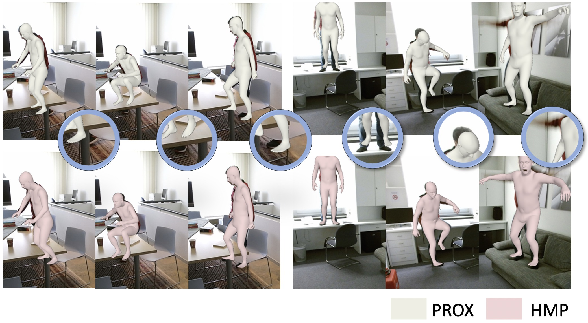

# Learning Motion Priors for 4D Human Body Capture in 3D Scenes (LEMO)
Official Pytorch implementation for 2021 ICCV (oral) paper "Learning Motion Priors for 4D Human Body Capture in 3D Scenes"

[[Project page]](https://sanweiliti.github.io/LEMO/LEMO.html) 
[[Video]](https://www.youtube.com/watch?v=AT14Y975-dc) 
[[Paper]](https://arxiv.org/pdf/2108.10399.pdf)




## Installation
The code has been tested on Ubuntu 18.04, python 3.8.5 and CUDA 10.0. Please download following models:
 * [SMPL-X models](https://smpl-x.is.tue.mpg.de): version 0.1.26
 * [VPoser model](https://smpl-x.is.tue.mpg.de): version 1.0 (source code included in the our repo, `human_body_prior` folder)

If you use the temporal fitting code for PROX dataset, please install following packages:
 * [Chamfer Pytorch](https://github.com/ThibaultGROUEIX/ChamferDistancePytorch/tree/719b0f1ca5ba370616cb837c03ab88d9a88173ff)
 * (optional) [Mesh Packages](https://github.com/MPI-IS/mesh): for contact / depth term
 * (optional) [PyTorch Mesh self-intersection](https://github.com/vchoutas/torch-mesh-isect): for self-interpenetration term
    * Download the per-triangle part segmentation: [smplx_parts_segm.pkl](https://owncloud.tuebingen.mpg.de/index.php/s/MWnr8Kso4K8T8at)
 
Then run `pip install -r requirements.txt` to install other dependencies.
It is noticed that different versions of `smplx` and `VPoser` might influece results.


## Datasets

* [PROX](https://prox.is.tue.mpg.de/)
* [AMASS](https://amass.is.tue.mpg.de/)


## Trained Prior Models
The pretrained models are in the `runs`. 
* Motion smoothness prior: in `runs/15217`
* Motion infilling prior: in `runs/59547`

The corresponding preprocessing stats are in the `preprocess_stats`
* For motion smoothness prior: `preprocess_stats/preprocess_stats_smooth_withHand_global_markers.npz`
* For motion infilling prior: `preprocess_stats/preprocess_stats_infill_local_markers_4chan.npz`


## Motion Prior Training
Train the motion smoothness prior model with:
```
python train_smooth_prior.py --amass_dir PATH/TO/AMASS --body_model_path PATH/TO/SMPLX/MODELS --body_mode=global_markers
```
Train the motion infilling prior model with:
```
python train_infill_prior.py --amass_dir PATH/TO/AMASS --body_model_path PATH/TO/SMPLX/MODELS --body_mode=local_markers_4chan
```

## Fitting on AMASS
**Stage 1: per-frame fitting**, utilize motion infilling prior (e.x., on TotalCapture dataset, from first motion sequence to 100th motion sequence, optimize a motion sequence every 20 motion sequences)
```
python opt_amass_perframe.py --amass_dir=PATH/TO/AMASS --body_model_path=PATH/TO/SMPLX/MODELS --body_mode=local_markers_4chan --dataset_name=TotalCapture --start=0 --end=100 --step=20 --save_dir=PATH/TO/SAVE/RESULUTS
```
**Stage 2: temporal fitting**, utilize motion smoothness and infilling prior (e.x., on TotalCapture dataset, from first motion sequence to 100th motion sequence, optimize a motion sequence every 20 motion sequences)
```
python opt_amass_tempt.py --amass_dir=PATH/TO/AMASS --body_model_path=PATH/TO/SMPLX/MODELS --body_mode=local_markers_4chan --dataset_name=TotalCapture --start=0 --end=100 --step=20 --perframe_res_dir=PATH/TO/PER/FRAME/RESULTS --save_dir=PATH/TO/SAVE/RESULTS
```
Make sure that `start`, `end`, `step`, `dataset_name` are consistent between per-frame and temporal fitting, and `save_dir` in per frame fitting and `perframe_res_dir` in temporal fitting are consistent.

**Visualization of fitted results:**
```
python vis_opt_amass.py --body_model_path=PATH/TO/SMPLX/MODELS --dataset_name=TotalCapture --start=0 --end=100 --step=20 --load_dir=PATH/TO/FITTED/RESULTS
```
Set `--vis_option=static` will visualize a motion sequence in static poses, and set `--vis_option=animate` will visualize a motion sequence as animations.
The folders `res_opt_amass_perframe` and `res_opt_amass_temp` provides several fitted sequences of Stage 1 and 2, resp..


## Fitting on PROX
**Stage 1: per-frame fitting**, utilize fitted params from PROX dataset directly
**Stage 2: temporal consistent fitting**: utilize motion smoothness prior
```
cd temp_prox
python main_slide.py --config=../cfg_files/PROXD_temp_S2.yaml --vposer_ckpt=/PATH/TO/VPOSER --model_folder=/PATH/TO/SMPLX/MODELS --recording_dir=/PATH/TO/PROX/RECORDINGS --output_folder=/PATH/TO/SAVE/RESULTS
```
**Stage 3: occlusion robust fitting**: utilize motion smoothness and infilling prior
```
cd temp_prox
python main_slide.py --config=../cfg_files/PROXD_temp_S3.yaml --vposer_ckpt=/PATH/TO/VPOSER --model_folder=/PATH/TO/SMPLX/MODELS --recording_dir=/PATH/TO/PROX/RECORDINGS --output_folder=/PATH/TO/SAVE/RESULTS
```
**Visualization of fitted results:**
```
cd temp_prox/
cd viz/
python viz_fitting.py --fitting_dir=/PATH/TO/FITTED/RESULTS --model_folder=/PATH/TO/SMPLX/MODELS --base_dir=/PATH/TO/PROX/DATASETS 
```

## Fitted Results of PROX Dataset
The temporal fitting results on PROX can be downloaded [here](https://drive.google.com/file/d/1UiEfUQtqBrv_pLscx_EW6d5f1oWEQaqm/view?usp=sharing).
It includes 2 file formats: 
* `PROXD_temp`: PROX format (consistent with original PROX dataset). Each frame fitting result is saved as a single file.
* `PROXD_temp_v2`: AMASS format (similar with AMASS dataset). Fitting results of a sequence are saved as a single file.
* `convert_prox_format.py` converts the data from `PROXD_temp` format to `PROXD_temp_v2` format and visualizes the convereted format.


### Citation

When using the code/figures/data/video/etc., please cite our work
```
@inproceedings{Zhang:ICCV:2021,
  title = {Learning Motion Priors for 4D Human Body Capture in 3D Scenes},
  author = {Zhang, Siwei and Zhang, Yan and Bogo, Federica and Pollefeys Marc and Tang, Siyu},
  booktitle = {International Conference on Computer Vision (ICCV)},
  month = oct,
  year = {2021}
}
```


## Acknowledgments 
This work was supported by the Microsoft Mixed Reality & AI Zurich Lab PhD scholarship. We sincerely thank Shaofei Wang and Jiahao Wang for proofreading.

## Relevant Projects
The temporal fitting code for PROX is largely based on the [PROX dataset code](https://github.com/mohamedhassanmus/prox). Many thanks to this wonderful repo.

